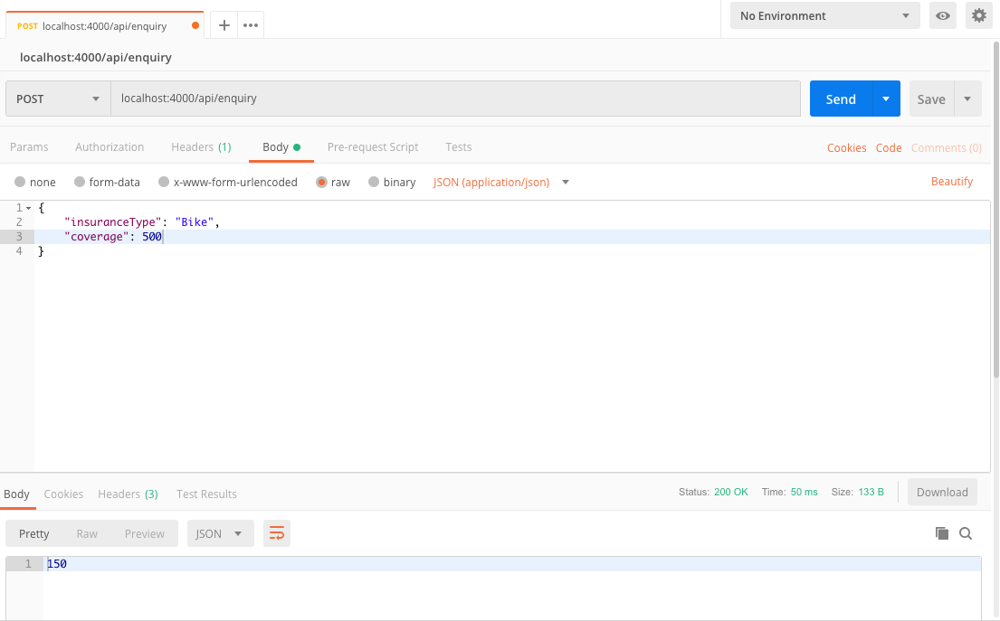

<h3><i>Full Stack Insurance Application using Spring Boot, React.js</i></h3>

Imagine a modular insurance product. People can choose from 4 modules. Each module has a different
selectable coverage and a different mathematical risk.
These are the modules:  

• Bike (Coverage 0-3k, Risk 30%) 
• Jewelry (Coverage 500-10k, Risk 5%) 
• Electronics (Coverage 500-6k, Risk 35%) 
• Sports Equipment (Coverage 0-20k, Risk 30%)  
The user should be able to select the coverage for each module and see the calculated price. The price of
the tariff, which is the individual configuration for each customer, should be calculated based on the risk: 
<h4>[price] = [coverage]*[risk]</h4>
The solution should store calculated prices and make them accessible via an endpoint.

    
    

    
    

